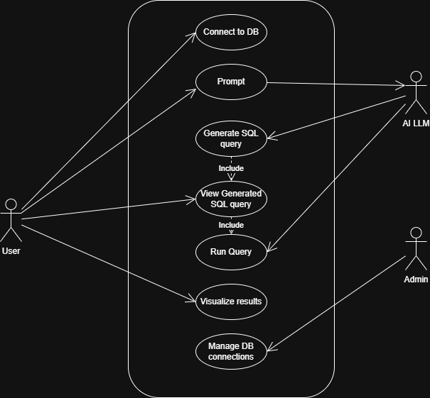
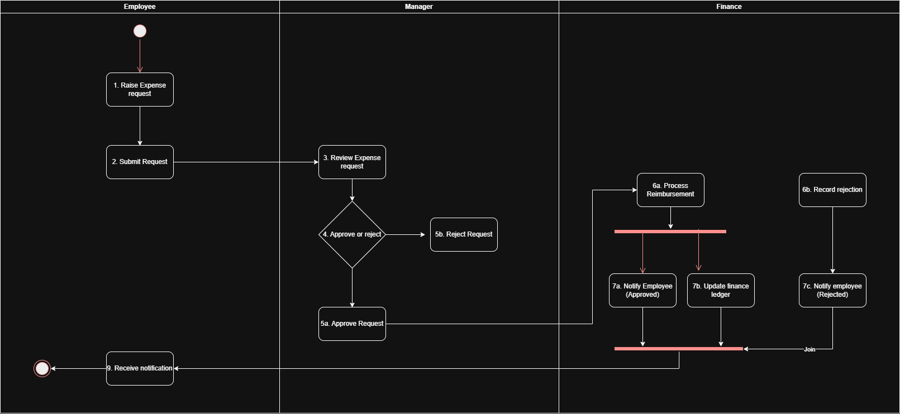
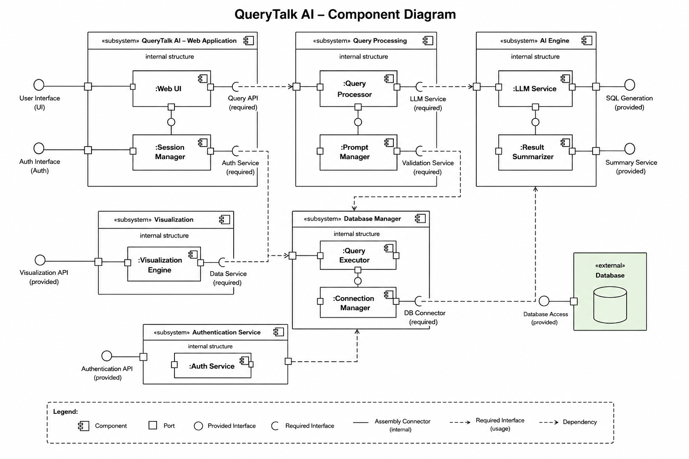
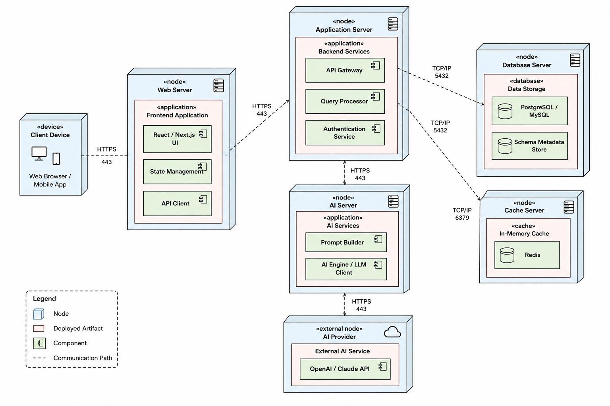

# UML Diagrams

Examples of different types of UML Diagrams.

## 1. Use Case Diagram

Shows interaction between users and the system.

---

## 2. User Flow Diagram

Represents complete user journey inside the platform.

---

## 3. Class Diagram

Represents internal structure and relationships between system components.

---

## 4. Sequence Diagram

Shows the sequence of operations from user query to dashboard generation.

---

## 5. Activity Diagram

Represents internal workflow and processing logic.

---

## 6. Component Diagram

Shows high-level architecture and system modules.

---

## 7. Deployment Diagram

Shows high-level architecture and system modules.

