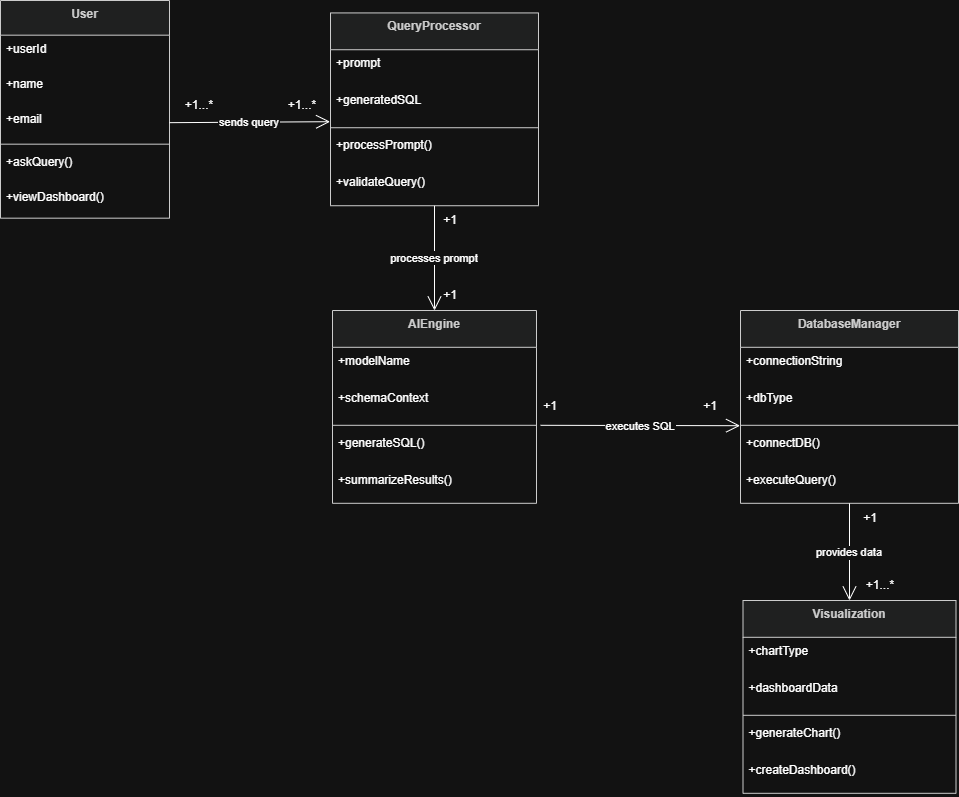

# QueryTalk AI

## AI-Powered Natural Language Database Interaction Platform

QueryTalk AI is an AI-powered database interaction platform that enables users to query databases using natural language instead of writing SQL manually.

The system converts plain English prompts into optimized SQL queries, securely executes them, and generates dashboards, charts, and insights in real time.

---

# Features

- Natural Language Database Querying
- AI-Based SQL Generation
- Secure Database Connections
- Real-Time Data Visualization
- AI-Generated Dashboards & Charts
- Conversational Data Analysis
- Trend Analysis & Insights
- Schema-Aware Query Understanding
- Multi-Database Support

---

# Tech Stack

| Layer | Technology |
|---|---|
| Frontend | React / Next.js |
| Backend | FastAPI / Node.js |
| AI Model | OpenAI / Claude |
| Database | PostgreSQL / MySQL |
| Visualization | Chart.js / Recharts |
| Deployment | Vercel / Render |

---

# System Workflow

1. User enters natural language query
2. AI processes user intent
3. Schema context is retrieved
4. SQL query is generated
5. Query is validated
6. Database executes query
7. Results are visualized
8. Dashboard and insights are generated

---

# UML Diagrams

## 1. Use Case Diagram

Shows interaction between users and the system.


---

## 2. User Flow Diagram

Represents complete user journey inside the platform.


---

## 3. Class Diagram

Represents internal structure and relationships between system components.



---

## 4. Sequence Diagram

Shows the sequence of operations from user query to dashboard generation.


---

## 5. Activity Diagram

Represents internal workflow and processing logic.


---

## 6. Component Diagram

Shows high-level architecture and system modules.


---

# Example Queries

```sql
Show total sales for the last 6 months
```

```sql
Find top 10 customers by spending
```

```sql
Generate monthly revenue trend chart
```

```sql
Show products with low inventory
```
